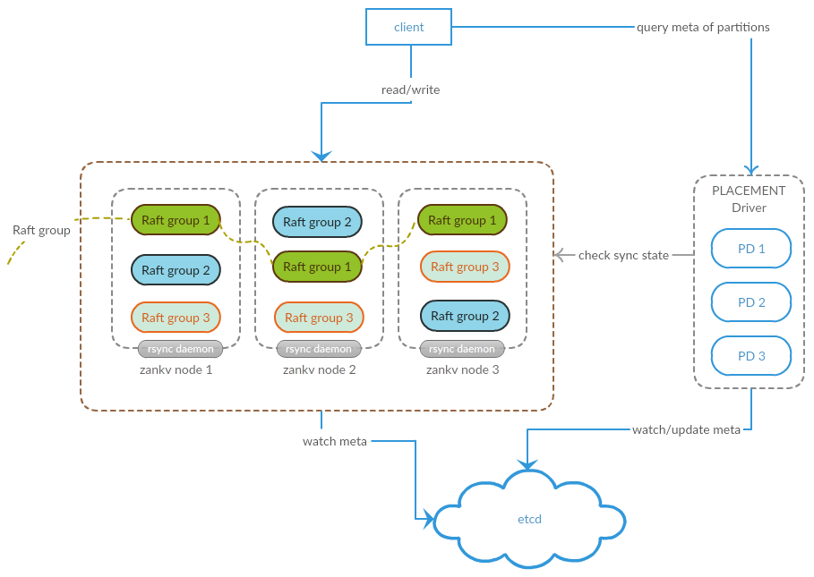
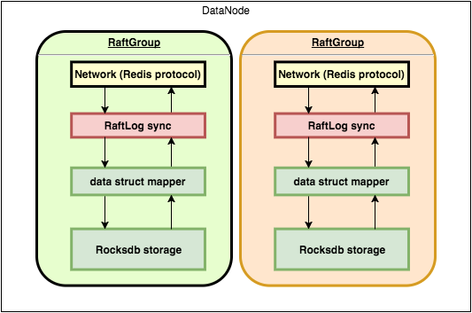

# Design

## 整体架构

### 集群架构

整个集群由placedriver + 数据节点datanode + etcd + rsync组成. 各个节点的角色如下:

PD node: 负责数据分布和数据均衡, 协调集群里面所有的zankv node节点, 将元数据写入etcd

datanode: 负责存储具体的数据

etcd: 负责存储元数据, 数据分布情况以及其他用于协调的元数据

rsync: 用于传输snapshot备份文件

### 数据节点架构

数据节点datanode有多个不同的分区组成, 每个分区是一个raftgroup. 每个分区由协议层redis, 日志同步层raftlog, 数据映射层和数据存储层构成.

redis协议层: 负责读取和解析客户端的redis命令, 并提交到raft层同步

raft日志同步层: 负责raft副本同步, 保证数据一致性

数据映射层: 负责将redis数据结构编码映射成db层的kv形式, 保证符合redis的数据结构语意

数据存储层: 负责封装rocksdb的kv操作.

数据节点会往etcd注册节点信息, 并且定时更新, 使得placedriver可以通过etcd感知自己.

### placedriver节点

placedriver负责指定的数据分区的节点分布, 还会在某个数据节点异常时, 自动重新分配数据分布. 总体上负责调度整个集群的数据节点的元数据. placedriver本身并不存储任何数据, 关于数据分布的元数据都是存储在etcd集群, 可以有多个placedriver作为读负载均衡, 多个placedriver通过etcd选举来产生一个master进行数据节点的分配和迁移任务. placedriver节点会watch集群的节点变化来感知整个集群的数据节点变化.

placedriver提供了数据分布查询接口, 供客户端sdk查询对应的数据分区所在节点.

## HA流程

### 服务端
- 正常下线时, 当前节点通过raft转移自己节点拥有的分区的leader节点, 自动摘除本机节点
- 新被选举出来的leader自动重新注册到etcd, 每个分区将当前最新的leader信息更新到etcd元数据
- placedriver监控leader节点变化, 一旦触发watch, 则自动从etcd刷新最新的leader返回给客户端
- 如果有客户端读写请求发送到非leader节点上, 服务端会返回特定的集群变更错误. 客户端刷新集群数据后重试

### go-sdk处理
- sdk启动时会启动一个定时lookup线程, 线程会定时的从placedriver服务中查询最新的leader信息, 并缓存到本地
- 读写操作时, 会从当前缓存的节点中找到对应的分区leader连接
- 通过连接发起读写操作时, 如果服务端返回了特定的错误信息, 则判断是否集群发生变更, 如果发生集群变更, 则立即触发查询最新leader信息, 并等待自动重试, 一直等到重试成功或者超过指定的超时时间和次数.
- 定时placedriver服务查询线程会剔除已经摘除的节点连接

## 分布式索引

由于分布式系统中, 一个索引会有多个分片, 为了保证多个分片之间的数据一致性, 需要协调多个分片的索引创建流程. 基本流程如下:

## 跨机房多集群同步